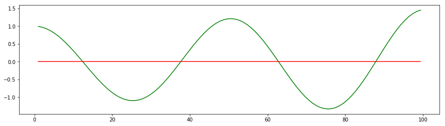
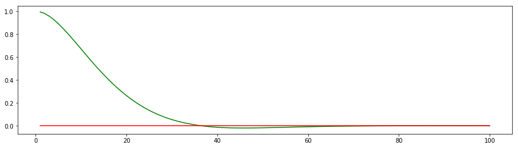
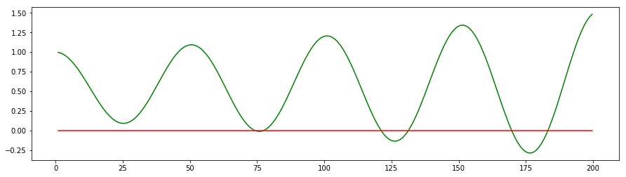
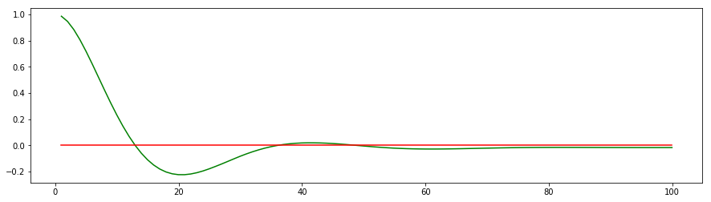
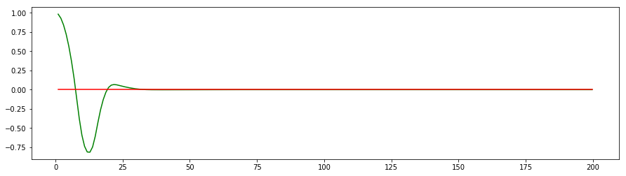

# CarND-Controls-PID
Self-Driving Car Engineer Nanodegree Program

---

## Introduction
PID (proportional integral derivative) control is one of the wide used control strategies in real world. The input for the controller is cross track error(cte). The simulator will provide this input as the car drive along the track. Assuming the cte is the distance between center of the car to center of the road. No lookahead or lookback. The simulator also provide speed and steering angle as available input,delta time can be calculated as well. The design goal for the PID controller is to provide stable steering and speed command to simulator. The controllor should drive around the lake side circle without danger movement or accident free.    

The PID as the name says, it has three terms, proportional term, integral term and derivative term. Each term has their own behaviour. 

## Proportional
The p term takes cte as input, calculate the `p_error = cte`; Depend on the output range and tuning requirement, the cte range may not match the output range, we need apply a linear Coefficient Kp to the p_error. Therefore the proportional term is respons linearly to the input cte. 

 

As the picture shown, the p term intent to drive the car towards the center, but always overshooting, the car endup with oscilliting, until out of the road and lost control. It need conjunction with other terms to make it works.   

## Derivative

The derivative term takes the cte rate of change as input, so it is based on `d_error = cte-previous_cte/delta_t`. 
It also need a linear Coefficient Kd to match the signal level and turning. Conjuncion with P controller, the PD controller behaviours close to what we are looking for. For the giving new control point, the controller measures the cte change rate, and d term linearly response to the measure, the result is the car get close to the center line, but not exectlly on it.  

 

## Integral

In reality, any control system will have some miss aligment, random noise and drift. The Integral term is to compensate this issue. The `i_error += cte`; We add all cte together, is the car is perfectly positioned, the cte from  left and right will cancel themself out. If the car is imperfect, we always need apply force on one side to keep it centered. So the sum of the cte can provide this input, we multiply a linear Coefficient Ki to match level and tuning. 
Conjunction with P controller, it behaviours like this.

 

The car will do the oscilliting, and always on one side. 

## Tuning PID Controller

If we put all three controller together, it will look like this. 

 

It looks all right, the car return to the center line with little some swing, it take about 80 steps to achieve that. 
By manually tuning the PID coefficients, we can make the controller react quickly for just about 60 steps. 

 

By doing a machine tuning, such as "twiddle", find the best P,I,D coefficients combination, the controller can reach the stable stage at just 30 steps. 

 

By far, all testing is done on one dimensional signal, one set of PID coefficients can do this job. But the simplified car is driven on 2 dimensional space, how can we do PID controller on different speed? 

## Speed

Can a simple PID controller be tuned for variable speed? [https://www.youtube.com/watch?v=Zij2BDvc8y0&t=27s]
As the video showning, if the PID controller is tuned at low speed, say 10mph, once the car reachs high speed, say 80mph, and the car only sensing the center line by looking down to get the cross track error. At the sharp turn, the cte rate of change may be too large, it will knock the car out of balance very quickly. Also, at high speed, small change in steering angle can cause a big swing as well. 

Since the simulator provides the valuable speed information, I am going to play with it. I used the speed in three places. 
1. I applied the `p_error = cte/speed;` insteed of `p_error = cte;` . So the P term behaviour chanaged. At low speed, it is sensitive to the cte, but at high speed, it is less sensitive to cte. It give the car some ability to self center itself. That is a desired feature. 

2. I applied the `d_error = diff_cte/ (speed*speed);` insteed of `d_error = diff_cte/delta_t;`. It is same idea in the P term,  but I want d term much less sensitive on high speed. The delta_t is close to a constant numberso I just took it out, the Kd will cover it. 

3. I applied `speed_value = -0.3 + 120/fabs(speed*angle);` on throttle input. It behaviours like: 
At High speed, small steering angle, full throttle; large steering angle(sharp turn, emergancy), reduced the throttle input, at certain point, negative throttle, means brake.   
At low speed, any angle, any positive throttle allowed.

## Smoothing

In simulator or real world, smoother steering is desired. I used three metholds together to smooth out the steering.

1. Build in self centering ability in the PID controller. As descributed in speed section, the controller is more stable at higher speed, it will take large cte to knock it out of balance.
   
2. Fine tuning the PID controller. There are the steps how I tuned the PID coefficients. 

First, P term only, adjust the Kp, until the p_error in between 0.001 to 0.5 at low speed. The car should be able to follow the track with huge swing. 
Second, open the D term, adjust the Kd, until the d_error in between 0.001 to 0.5 at low speed, The car will be more smoother than P alone. 
Third, apply very small Ki, such as 0.001, see anything changes. I end up with Ki = 0.0051, and i_error always around 0.4, because of the car makes more left turns than right turns on this track.  

3. Apply rolling average to the steering output

I applied appoximate rolling average to the steering output as well. The averaging number from 1 to 8. 
If number = 1, means no averaging, same steering output value send to the simulator.
If higher number, the weight averaged steering output value send to the simulator. 
The car behaviours really really stable at high speed, I can reach 90 mph on the bridge, but the car is not able to make the sharp turn. Also, the car is more sensitive at lower speed. Therefore, I designed a shifting feature, It work like this:
1. Start at number 1, as the car rolling, it will shift the averaging number 1 by 1 to the maximum number. The car is stablized. 
2. Conjunction with cte, speed and angle measurement, if the car reaches a big turn, the car will apply brake, reduce the speed, drop the averaging number to 1, bring up the sensitive, the P term will figure out the sharp angle to make the turn. 
3. Then the D term will balancing out the steering output. the averaging number will rise again, the car is going to new stable stage again. 

## Reflection

The above discussion sounds lot of activities involved, but implemtation is quit simple. I think that is why PID is a propular controller. The PID controller is easy to build, not so easy to tune. 

At fixed speed, it is possible to find the optimal parameter Kp, Ki, and Kd, it will take about 20 - 30 inputs, at least one or two wave length to stablize. 

For variable speed, I tried my way to tune the parameter with speed and steering together. The limitation is the way we sensing the cte. If I can look ahead 1-3 seconds on the road, it can achieve both higher speed and stable run. 

Based on current setting, The PID controller still useful for speed up to 50 MPH, max 70 MPH[https://www.youtube.com/watch?v=9njADnlCY7I]. The car still swing. It actually need to swing in order to sensing the sharp turns. Once the turn is detected, the combination of reaction will take place, brake, down shift, turn, up shift again.        

I did a reverse gear run on the track at 30 MPH[https://www.youtube.com/watch?v=40yiQtKU9ao], it is stable like on train track most of the time.  

In conclusion, this project is a reactive PID controller. It is a great eye openner to taste the challenge in self-driving car. I am looking forward to see an improved simulator with look ahead sensing, and different tracks. I also want to check how the current on the market PID controller is tuned.   

## Dependencies

* cmake >= 3.5
 * All OSes: [click here for installation instructions](https://cmake.org/install/)
* make >= 4.1
  * Linux: make is installed by default on most Linux distros
  * Mac: [install Xcode command line tools to get make](https://developer.apple.com/xcode/features/)
  * Windows: [Click here for installation instructions](http://gnuwin32.sourceforge.net/packages/make.htm)
* gcc/g++ >= 5.4
  * Linux: gcc / g++ is installed by default on most Linux distros
  * Mac: same deal as make - [install Xcode command line tools]((https://developer.apple.com/xcode/features/)
  * Windows: recommend using [MinGW](http://www.mingw.org/)
* [uWebSockets](https://github.com/uWebSockets/uWebSockets) == 0.13, but the master branch will probably work just fine
  * Follow the instructions in the [uWebSockets README](https://github.com/uWebSockets/uWebSockets/blob/master/README.md) to get setup for your platform. You can download the zip of the appropriate version from the [releases page](https://github.com/uWebSockets/uWebSockets/releases). Here's a link to the [v0.13 zip](https://github.com/uWebSockets/uWebSockets/archive/v0.13.0.zip).
  * If you run OSX and have homebrew installed you can just run the ./install-mac.sh script to install this
* Simulator. You can download these from the [project intro page](https://github.com/udacity/CarND-PID-Control-Project/releases) in the classroom.

## Basic Build Instructions

1. Clone this repo.
2. Make a build directory: `mkdir build && cd build`
3. Compile: `cmake .. && make`
4. Run it: `./pid`. 

## Editor Settings

We've purposefully kept editor configuration files out of this repo in order to
keep it as simple and environment agnostic as possible. However, we recommend
using the following settings:

* indent using spaces
* set tab width to 2 spaces (keeps the matrices in source code aligned)

## Code Style

Please (do your best to) stick to [Google's C++ style guide](https://google.github.io/styleguide/cppguide.html).

## Project Instructions and Rubric

Note: regardless of the changes you make, your project must be buildable using
cmake and make!

More information is only accessible by people who are already enrolled in Term 2
of CarND. If you are enrolled, see [the project page](https://classroom.udacity.com/nanodegrees/nd013/parts/40f38239-66b6-46ec-ae68-03afd8a601c8/modules/f1820894-8322-4bb3-81aa-b26b3c6dcbaf/lessons/e8235395-22dd-4b87-88e0-d108c5e5bbf4/concepts/6a4d8d42-6a04-4aa6-b284-1697c0fd6562)
for instructions and the project rubric.

## Hints!

* You don't have to follow this directory structure, but if you do, your work
  will span all of the .cpp files here. Keep an eye out for TODOs.

## Call for IDE Profiles Pull Requests

Help your fellow students!

We decided to create Makefiles with cmake to keep this project as platform
agnostic as possible. Similarly, we omitted IDE profiles in order to we ensure
that students don't feel pressured to use one IDE or another.

However! I'd love to help people get up and running with their IDEs of choice.
If you've created a profile for an IDE that you think other students would
appreciate, we'd love to have you add the requisite profile files and
instructions to ide_profiles/. For example if you wanted to add a VS Code
profile, you'd add:

* /ide_profiles/vscode/.vscode
* /ide_profiles/vscode/README.md

The README should explain what the profile does, how to take advantage of it,
and how to install it.

Frankly, I've never been involved in a project with multiple IDE profiles
before. I believe the best way to handle this would be to keep them out of the
repo root to avoid clutter. My expectation is that most profiles will include
instructions to copy files to a new location to get picked up by the IDE, but
that's just a guess.

One last note here: regardless of the IDE used, every submitted project must
still be compilable with cmake and make./
