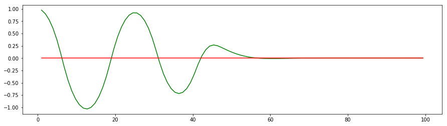

# CarND-Controls-PID
Self-Driving Car Engineer Nanodegree Program

---

## Introduction
PID (proportional integral derivative) control is one of the earlier control strategies. The input for the controller is cross track error(cte). The simulator will provide this input as the car drive along the track. Asseming the cte is the distance between center of the car to center of the road. No lookahead or lookback. The simulator also provide speed and steering angle as available input,delta time can be calculated as well. The design goal for the PID controller is to provide stable steering and speed command to simulator. The controllor should drive around the lake side circle without danger movement or accident free.    

The PID as the name says, it has three parts, proportional term, integral term and derivative term. Each term has their own behaviour. 

## Proportional
The p term takes cte as input, calculate the `p_error = cte`; Depend on the output range and tuning requirement, the cte range may not match the output range, we need apply a linear Coefficient Kp to the p_error. Therefore the proportional term is respons linearly to the input cte. 

 

As the picture shown, the p term intent to drive the car towards the center, but always overshooting, the car endup with oscilliting, until out of the road and lost control. It need conjunction with other terms to make it works.   

## Derivative
The derivative term takes the cte rate of change as input, so it is based on `d_error = cte-previous_cte/delta_t`. 
It also need a linear Coefficient Kd to match the signal level and turning. Conjuncion with P controller, the PD controller behaviours close to what we are looking for. For the giving new control point, the controller measures the cte change rate, and d term linearly response to the measure, the result is the car get close to the center line, but not exectlly on it.  

 

## Integral
In reality, any control system will have some miss aligment, random noise and drift. The Integral term is to compensate this issue. The `i_error += cte`; We add all cte together, is the car is perfectly positioned, the cte from  left and right will cancel themself out. If the car is imperfect, we always need apply force on one side to keep it centered. So the sum of the cte can provide this input, we multiply a linear Coefficient Ki to match level and tuning. 
Conjunction with P controller, it behaviours like this.

 

## Tuning PID Controller
If we put all three controller together, it will look like this. 

 

 

 

## Speed
## Smoothing
## Reflection

## Dependencies

* cmake >= 3.5
 * All OSes: [click here for installation instructions](https://cmake.org/install/)
* make >= 4.1
  * Linux: make is installed by default on most Linux distros
  * Mac: [install Xcode command line tools to get make](https://developer.apple.com/xcode/features/)
  * Windows: [Click here for installation instructions](http://gnuwin32.sourceforge.net/packages/make.htm)
* gcc/g++ >= 5.4
  * Linux: gcc / g++ is installed by default on most Linux distros
  * Mac: same deal as make - [install Xcode command line tools]((https://developer.apple.com/xcode/features/)
  * Windows: recommend using [MinGW](http://www.mingw.org/)
* [uWebSockets](https://github.com/uWebSockets/uWebSockets) == 0.13, but the master branch will probably work just fine
  * Follow the instructions in the [uWebSockets README](https://github.com/uWebSockets/uWebSockets/blob/master/README.md) to get setup for your platform. You can download the zip of the appropriate version from the [releases page](https://github.com/uWebSockets/uWebSockets/releases). Here's a link to the [v0.13 zip](https://github.com/uWebSockets/uWebSockets/archive/v0.13.0.zip).
  * If you run OSX and have homebrew installed you can just run the ./install-mac.sh script to install this
* Simulator. You can download these from the [project intro page](https://github.com/udacity/CarND-PID-Control-Project/releases) in the classroom.

## Basic Build Instructions

1. Clone this repo.
2. Make a build directory: `mkdir build && cd build`
3. Compile: `cmake .. && make`
4. Run it: `./pid`. 

## Editor Settings

We've purposefully kept editor configuration files out of this repo in order to
keep it as simple and environment agnostic as possible. However, we recommend
using the following settings:

* indent using spaces
* set tab width to 2 spaces (keeps the matrices in source code aligned)

## Code Style

Please (do your best to) stick to [Google's C++ style guide](https://google.github.io/styleguide/cppguide.html).

## Project Instructions and Rubric

Note: regardless of the changes you make, your project must be buildable using
cmake and make!

More information is only accessible by people who are already enrolled in Term 2
of CarND. If you are enrolled, see [the project page](https://classroom.udacity.com/nanodegrees/nd013/parts/40f38239-66b6-46ec-ae68-03afd8a601c8/modules/f1820894-8322-4bb3-81aa-b26b3c6dcbaf/lessons/e8235395-22dd-4b87-88e0-d108c5e5bbf4/concepts/6a4d8d42-6a04-4aa6-b284-1697c0fd6562)
for instructions and the project rubric.

## Hints!

* You don't have to follow this directory structure, but if you do, your work
  will span all of the .cpp files here. Keep an eye out for TODOs.

## Call for IDE Profiles Pull Requests

Help your fellow students!

We decided to create Makefiles with cmake to keep this project as platform
agnostic as possible. Similarly, we omitted IDE profiles in order to we ensure
that students don't feel pressured to use one IDE or another.

However! I'd love to help people get up and running with their IDEs of choice.
If you've created a profile for an IDE that you think other students would
appreciate, we'd love to have you add the requisite profile files and
instructions to ide_profiles/. For example if you wanted to add a VS Code
profile, you'd add:

* /ide_profiles/vscode/.vscode
* /ide_profiles/vscode/README.md

The README should explain what the profile does, how to take advantage of it,
and how to install it.

Frankly, I've never been involved in a project with multiple IDE profiles
before. I believe the best way to handle this would be to keep them out of the
repo root to avoid clutter. My expectation is that most profiles will include
instructions to copy files to a new location to get picked up by the IDE, but
that's just a guess.

One last note here: regardless of the IDE used, every submitted project must
still be compilable with cmake and make./
